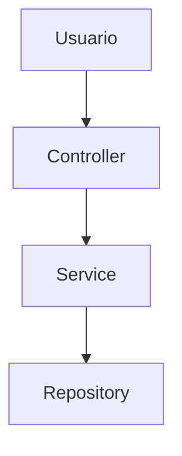

# 📝 Guía de Estilo - Documentación

Convenciones y estándares para la documentación del LikePlatform React Starter.

---

## 🎯 Principios Generales

1. **Claridad**: Lenguaje directo y conciso
2. **Consistencia**: Formato uniforme en todos los documentos
3. **Accesibilidad**: Fácil de navegar y buscar
4. **Actualización**: Mantener sincronizado con el código

---

## 📐 Estructura de Documentos

### Encabezado Principal

```markdown
# 📚 Título del Documento

Descripción breve (1-2 líneas) del contenido.

---
```

### Secciones Principales

Usar emojis consistentes para tipos de secciones:

- 🎯 **Objetivos/Propósito**
- 📊 **Resumen/Estadísticas**
- ⚙️ **Configuración/Setup**
- 🚀 **Características/Features**
- 💻 **Código/Ejemplos**
- 🧪 **Testing/Pruebas**
- 📝 **Notas/Observaciones**
- ⚠️ **Advertencias/Importante**
- 🔍 **Búsqueda/Referencia**
- 🤝 **Contribución**

### Pie de Documento

```markdown
---

**Última actualización**: YYYY-MM-DD  
**Versión**: X.Y.Z  
**Autor**: Nombre (opcional)
```

---

## 🎨 Formato de Contenido

### Títulos

```markdown
# Nivel 1 - Título principal (solo uno por documento)
## Nivel 2 - Secciones principales
### Nivel 3 - Subsecciones
#### Nivel 4 - Detalles (usar con moderación)
```

### Listas

**Listas con viñetas**:
```markdown
- Primer elemento
- Segundo elemento
  - Sub-elemento (2 espacios de indentación)
```

**Listas numeradas**:
```markdown
1. Primer paso
2. Segundo paso
3. Tercer paso
```

**Listas con énfasis**:
```markdown
- **Título en negrita**: Descripción del elemento
- **Otro título**: Otra descripción
```

### Código

**Inline code**:
```markdown
Usa `código inline` para nombres de archivos, variables, comandos cortos.
```

**Bloques de código**:
````markdown
```bash
# Comandos de terminal
php artisan migrate
```

```php
// Código PHP
public function example(): void
{
    // ...
}
```

```tsx
// Código TypeScript/React
export default function Component() {
  return <div>Hello</div>
}
```
````

### Enlaces

**Enlaces internos** (relativos desde `/docs`):
```markdown
Ver [Guía de Packages](guias/packages-rapida.md)
Ver [Sistema de Temas](sistemas/theme-implementado.md)
```

**Enlaces externos**:
```markdown
[Laravel Documentation](https://laravel.com/docs)
```

### Tablas

```markdown
| Columna 1 | Columna 2 | Columna 3 |
|-----------|-----------|-----------|
| Valor 1   | Valor 2   | Valor 3   |
| Valor 4   | Valor 5   | Valor 6   |
```

### Citas y Notas

```markdown
> **Nota**: Información importante que destacar

> **Advertencia**: Algo crítico a tener en cuenta

> **Tip**: Consejo útil para el usuario
```

---

## 📁 Nomenclatura de Archivos

### Convenciones

- **Formato**: `kebab-case.md`
- **Idioma**: Español (contenido), inglés (términos técnicos)
- **Descriptivo**: Nombre debe indicar claramente el contenido

### Ejemplos

✅ **Correcto**:
- `packages-rapida.md`
- `settings-final.md`
- `laravel-boost-guidelines.md`

❌ **Incorrecto**:
- `PACKAGES_RAPIDA.md` (mayúsculas)
- `SettingsFinal.md` (PascalCase)
- `doc1.md` (no descriptivo)

---

## 🗂️ Organización por Carpetas

### `/docs/guias/`
Documentos prácticos para usuarios:
- Tutoriales paso a paso
- Guías de inicio rápido
- How-to guides

### `/docs/sistemas/`
Documentación técnica de sistemas:
- Arquitectura de sistemas
- Documentación completa de features
- Referencias técnicas

### `/docs/desarrollo/`
Documentación para desarrolladores:
- Directrices de desarrollo
- Roadmaps y planes
- Estrategias de Git
- Guidelines y convenciones

### `/docs/implementaciones/`
Documentación de procesos:
- Guías de commit
- Reportes de implementación
- Resultados de tests
- Verificaciones

---

## ✍️ Estilo de Escritura

### Tono

- **Profesional** pero **accesible**
- **Directo** y **conciso**
- **Técnico** cuando sea necesario
- **Amigable** sin ser informal

### Voz

- Preferir **voz activa**: "Ejecuta el comando" vs "El comando debe ser ejecutado"
- Usar **segunda persona** cuando sea apropiado: "Puedes configurar..." vs "Se puede configurar..."

### Términos Técnicos

- **Mantener en inglés**: package, controller, middleware, route, etc.
- **Usar comillas** para términos específicos: El "starter kit" incluye...
- **Definir acrónimos** en primera mención: MCP (Model Context Protocol)

---

## 🔧 Ejemplos de Código

### Buenas Prácticas

1. **Incluir contexto**: Mostrar imports y estructura necesaria
2. **Comentar lo importante**: No sobre-comentar código obvio
3. **Usar ejemplos reales**: Preferir código del proyecto
4. **Indicar lenguaje**: Siempre especificar el lenguaje del bloque

### Ejemplo Completo

````markdown
### Crear un Package

1. Crear la estructura básica:

```bash
mkdir -p packages/mi-package/src
cd packages/mi-package
```

2. Crear el archivo `Package.php`:

```php
<?php

namespace MiPackage;

use App\Contracts\CustomizationPackageInterface;

class Package implements CustomizationPackageInterface
{
    public function getName(): string
    {
        return 'mi-package';
    }
}
```

3. Registrar en `composer.json`:

```json
{
  "autoload": {
    "psr-4": {
      "MiPackage\\": "packages/mi-package/src/"
    }
  }
}
```
````

---

## 📊 Elementos Visuales

### Diagramas

Usar Mermaid para diagramas cuando sea útil:

````markdown

````

### Badges

Para estados o versiones:

```markdown


```

---

## ✅ Checklist de Revisión

Antes de finalizar un documento:

- [ ] Título claro y descriptivo
- [ ] Descripción breve al inicio
- [ ] Estructura con secciones lógicas
- [ ] Código con sintaxis highlighting
- [ ] Enlaces funcionando correctamente
- [ ] Sin errores ortográficos
- [ ] Formato consistente con otros docs
- [ ] Fecha de actualización al final
- [ ] Nombre de archivo en kebab-case
- [ ] Ubicado en carpeta correcta

---

## 🔄 Mantenimiento

### Actualización de Documentos

- Actualizar fecha al modificar contenido
- Incrementar versión si hay cambios significativos
- Mantener changelog si el documento es extenso
- Revisar enlaces rotos periódicamente

### Deprecación

Si un documento queda obsoleto:

1. Agregar nota al inicio: `> **⚠️ DEPRECADO**: Este documento está obsoleto...`
2. Enlazar al documento actualizado
3. Considerar mover a carpeta `/docs/deprecated/`

---

**Última actualización**: 2025-10-08  
**Versión**: 1.0.0
